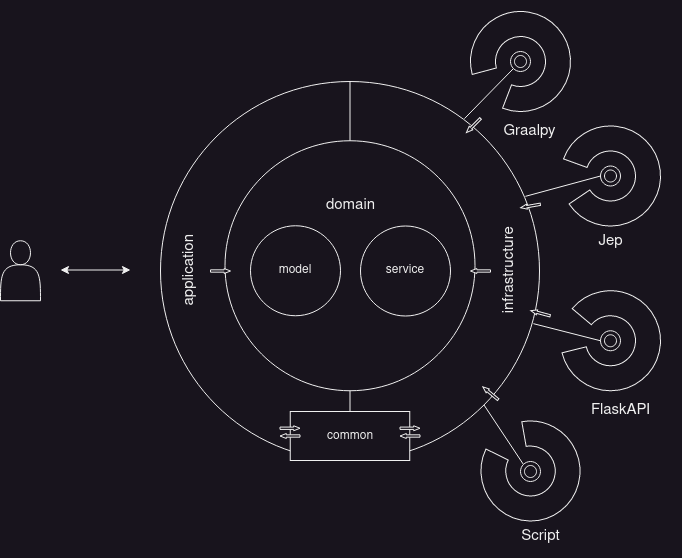

# Table of Contents
- [Table of Contents](#table-of-contents)
- [About the Project](#about-the-project)
- [Description](#description)
- [Built With](#built-with)
- [Getting Started](#getting-started)
- [Prerequisites](#prerequisites)
- [Installation](#installation)
- [Usage](#usage) 
- [Roadmap](#roadmap)
- [Contributing](#contributing)
- [License](#license)
- [Contact](#contact)
- [Acknowledgements](#acknowledgements)

# About the Project

# Description
Proof of concept to call python code from java. he small research done in performing image enhancement (super resolution) 
on small thumbnails. The actual enhancement is done by a python library. We proceeded to explore the following scenarios 
for the Image Super Resolution enhancement python library. Using a Script, JEP, Flask+API, and GraalPython
The following examples show the expected outcome:

# Built With
* [GraalVM](https://www.graalvm.org)
* [Python](https://www.python.org/) 
* [Java](https://www.java.com)
* [Spring Boot](https://spring.io)

# Getting Started
# Prerequisites & Dependencies
``` 
# to download graalVM (this will include python and nodejs)
  sudo bash <(curl -sL https://get.graalvm.org/jdk) -c python,nodejs graalvm-ee-java11-22.3.1
# after extracting it install it in
  /usr/lib/jvm/graalvm-ce-java11-22.3.1
#set JAVA_HOME to a GraalVM with Python installed.
  export JAVA_HOME="/usr/lib/jvm/graalvm-ce-java11-22.3.1"
```

```
 (python interpreter)              => python 3.10
 (python package manager)          => pip
 (img super resolution dependency) => pip install ISR or python3 ../image-super-resolution/setup.py install
 (environment variable)            => export JAVA_HOME="/usr/lib/jvm/java-11-openjdk-amd64"
 (java python interpreter)         => pip install jep
```
* [Python 3.10](https://www.python.org)
* On ubuntu 
```
  apt-get install python3 python3-setuptools python3-pip
```
* [Image Super Resolution](https://github.com/idealo/image-super-resolution)
``` 
git clone https://github.com/idealo/image-super-resolution.git

# to install the ISR library
  pip install ISR
or
  python3 ./image-super-resolution/setup.py install
```
* [Image Super Resolution Flask API](https://github.com/europeana/rd-img-superresolution.git)
```
git clone https://github.com/europeana/rd-img-superresolution.git

# to run the Flask API 
cd model-api
python3 apy.py
```

# Installation Proof of concept project

```
git clone https://github.com/jeortizquan/poc-image-super-resolution.git
```

# Usage

### Endpoint design specification
### 1. Select the path of a image that you want to enhance

#### JSON Format
```
curl --header "Content-type: application/json" --request POST http://<host>:<port>/enhance -d '{ "input" : "/pathToFile.jpg" }'
```
Response:
```
HTTP code: 200 Response Body: 
{"output":"/pathToFileYYYY-MM-DD_HH_mm_ss.jpg"}% 
```

### 3. Run API Controller locally 
Note: Java and Maven are prerequisites.

Windows
```
mvnw spring-boot:run
```

MacOS/Linux
```
./mvnw spring-boot:run
```

Note: If you want to run tests
the flask API server has to be running...
```
   mvn clean verify
```
# Design architecture


"The motivation behind the design summarizes in the following concept
The communication goes from outer layers to the inner layers."

*The application layer contains details over the spring framework, 
*The common layer provides the communication between application and infrastructure classes 
*The infrastructure layer contains the adapter pattern implementation to plug in any thumbnail enhancement
*The domain contains the model and service business logic, so this remains untouched by external changes
of the outer layers as much as possible.

# Roadmap
- [x] proof of concept.
- [ ] add swagger.
- [ ] add spring boot actuator.
- [ ] convert it to a library.

# Contributing
Any contributions you make are appreciated.

1. Fork the Project
2. Create your Feature Branch (git checkout -b feature/AmazingFeature)
3. Commit your Changes (git commit -m 'Add some AmazingFeature')
4. Push to the Branch (git push origin feature/AmazingFeature)
5. Open a Pull Request

# Contact
jorge.ortiz@europeana.eu

# Acknowledgements
Blessed are the merciful, for they will be shown mercy.
